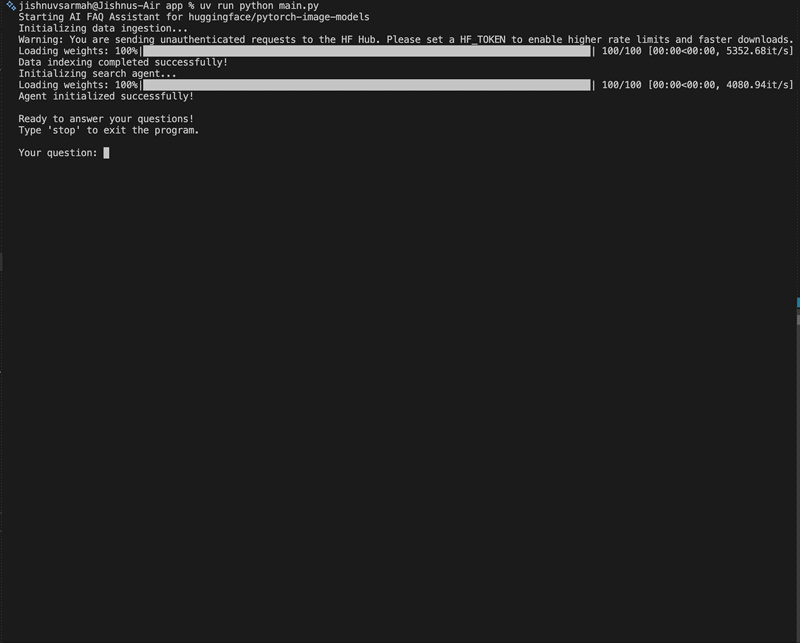
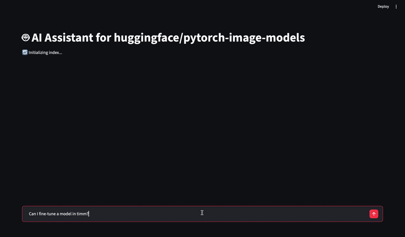

# 📘 AI Repository Assistant (timm / HuggingFace)

## 1. Project Title & Description

**AI Repository Assistant**  
An intelligent assistant that answers questions about GitHub repositories using hybrid search and LLMs.

> Built initially for the pytorch-image-models (timm) repository, but easily extensible to any repository.

---

## 2. Overview

### 🚩 Problem

Large GitHub repositories contain extensive documentation across many markdown files.  
Finding precise answers manually is time-consuming.

### 💡 Solution

This project builds an AI-powered assistant that:
- Downloads repository content dynamically
- Indexes documentation
- Enables semantic + keyword search
- Uses an LLM agent to answer questions with context

### ⚡ Why it’s useful / unique

- Hybrid search (keyword + vector)
- Tool-augmented LLM (pydantic-ai)
- Works on any repo (config-based)
- Streamlit UI + CLI support
- Context-aware answers with references

---

## 3. Installation

### 📋 Requirements

- Python 3.13+
- API Key (OpenAI or Groq)
- uv (recommended)

### ⚙️ Setup

```bash
# Make sure you have uv
pip install uv

# Clone this repo
git clone https://github.com/jishnuvs78/RepoMind.git

# Install dependencies
uv sync
```

### ▶️ Run commands

```bash
uv run python main.py
uv run streamlit run app.py
```

### 🔐 Environment Variables

Create a `.env` file:

```env
OPENAI_API_KEY=your_key_here
# or
GROQ_API_KEY=your_key_here
```

---

## 4. Usage

### ▶️ CLI

```bash
uv run python main.py
```

This opens an interactive CLI environment. You can ask the conversational agent any question about the course.



Type `stop` to exit.

### 🌐 Streamlit

```bash
uv run streamlit run app.py
```



This launches a Streamlit app. You can chat with the assistant in your browser.  

The app is available at [http://localhost:8501](http://localhost:8501).

### ⚙️ Config

Modify:

```python
REPO_OWNER = "huggingface"
REPO_NAME = "pytorch-image-models"
```

---

## 5. Features

- Hybrid search (keyword + semantic)
- Automatic repo ingestion
- Markdown parsing + chunking
- LLM agent with tools
- CLI + Streamlit UI
- Logging system
- Easily extensible

---

## Evaluations

We evaluate the agent using the following criteria:

- `instructions_follow`: The agent followed the user's instructions
- `instructions_avoid`: The agent avoided doing things it was told not to do  
- `answer_relevant`: The response directly addresses the user's question  
- `answer_clear`: The answer is clear and correct  
- `answer_citations`: The response includes proper citations or sources when required  
- `completeness`: The response is complete and covers all key aspects of the request
- `tool_call_search`: Is the search tool invoked? 

We do this in two steps:

- First, we generate synthetic questions (see [`eval/data-gen.ipynb`](eval/data-gen.ipynb))
- Next, we run our agent on the generated questions and check the criteria (see [`eval/evaluations.ipynb`](eval/evaluations.ipynb))

Current evaluation metrics:

```
instructions_follow     33.333333
instructions_avoid     100.000000
answer_relevant        100.000000
answer_clear            50.000000
answer_citations        33.333333
completeness            50.000000
tool_call_search       100.000000
```

The most important metric for this project is `answer_relevant`. This measures whether the system's answer is relevant to the user. It's currently 100%, meaning all answers were relevant. 

Improvements: Our evaluation is currently based on only 6 questions. We need to collect more data for a more comprehensive evaluation set.

## 6. Tests

Manual testing recommended:

- Ask questions about the repo
- Validate correctness of responses

---

## 7. Deployment

### 🌐 Options

- Streamlit Cloud
- Heroku
- Fly.io
- Render

### 📁 Logs

Logs are stored locally in:

```
logs/
```

Custom path:

```env
LOGS_DIRECTORY=your/custom/path
```

### ⚙️ Production Tips

- Add CI/CD (GitHub Actions)
- External logging storage
- Optimize indexing / vector DB

---

## 8. FAQ / Troubleshooting

### ❓ Missing dependencies

Run:

```bash
uv sync
```

Ensure Python 3.13+ is installed.

---

## 9. Credits

- Hugging Face
- Sentence Transformers
- minsearch
- pydantic-ai
- Streamlit

---

## 💬 Final Note

This project demonstrates how to build tool-augmented LLM systems over real-world repositories.
